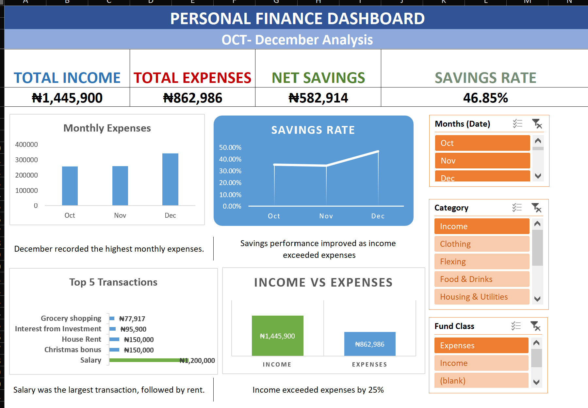
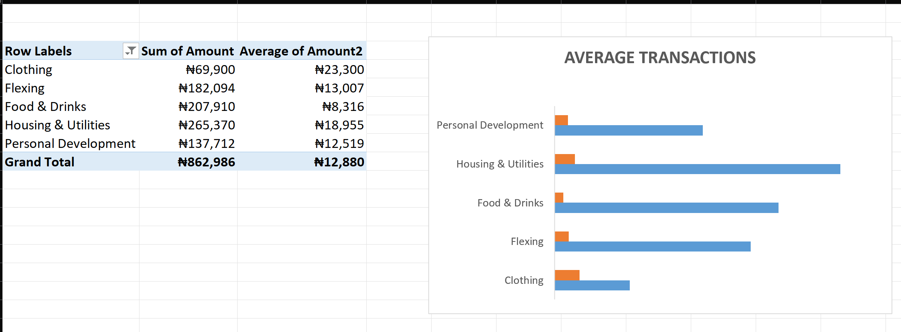
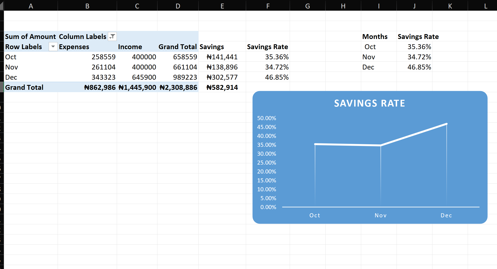
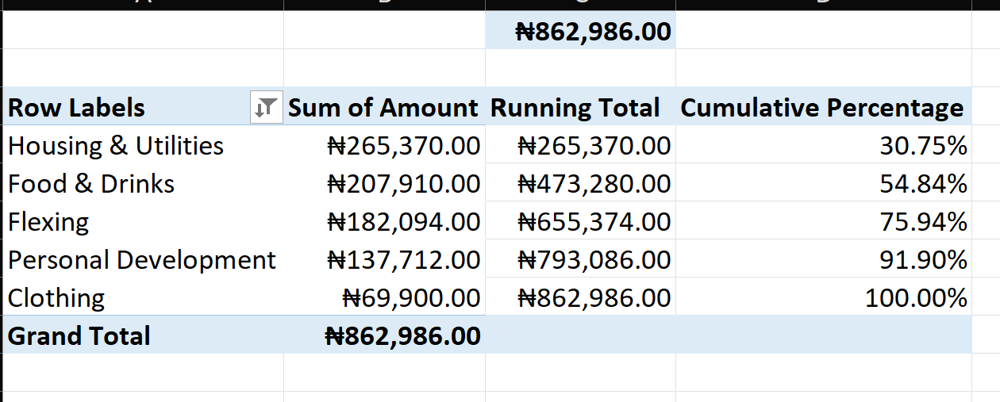
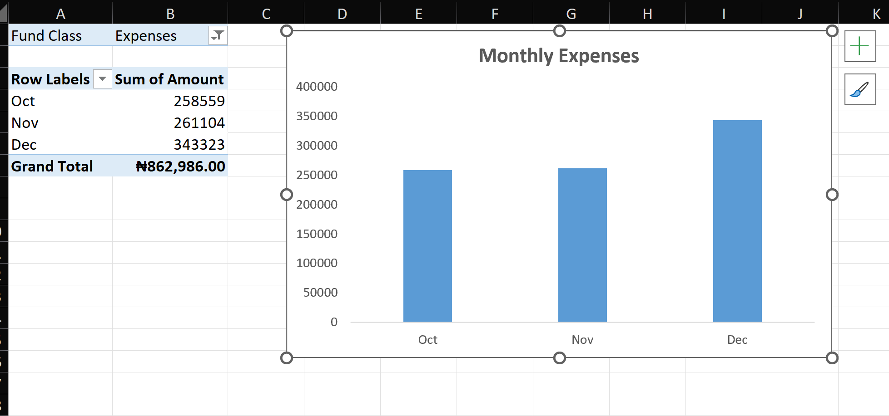
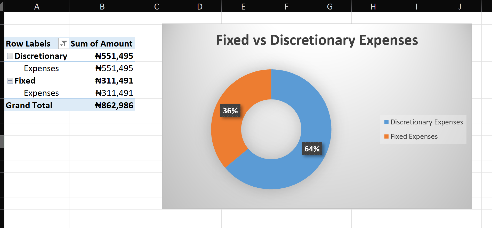

# Personal Finance Dashboard | Excel Data Analytics Project

## Project Overview

This project is an Excel-based personal finance analysis and dashboard created to transform raw financial transaction data into meaningful business insights.

The project covers data preparation, financial calculations, PivotTables, PivotCharts, KPI reporting, slicers, dashboard design, and interpretation of spending patterns.

The goal was to move from raw transaction data to a clear and interactive dashboard that answers practical financial questions and supports better spending decisions.

---

## Business Questions

The analysis was designed to answer the following questions:

1. What are the total expenses by category?
2. Which expense categories contribute the most to overall spending?
3. Which categories have the highest number of transactions?
4. How do total income and expenses compare?
5. How does the savings rate change over time?
6. How is spending distributed between Credit Card and Cash transactions?
7. What are the five highest-value transactions?
8. Which expense categories have the highest average transaction value?
9. Does the Pareto Principle (80/20 Rule) apply to the expenses?
10. How is total expenditure distributed between Fixed and Discretionary expenses?

---

## Tools & Techniques

- Microsoft Excel
- Data Cleaning and Preparation
- Excel Tables
- Formulas and Financial Calculations
- PivotTables
- PivotCharts
- KPI Reporting
- Slicers
- Dashboard Design
- Category Analysis
- Trend Analysis
- Pareto Analysis
- Business Insights and Recommendations

---

## Data Preparation

The raw transaction data was structured and prepared for analysis before building the dashboard.

Key preparation activities included:

- Standardizing transaction information
- Reviewing income and expense classifications
- Organizing financial categories
- Checking transaction values
- Creating an Excel Table for analysis
- Preparing data for PivotTables and PivotCharts
- Validating calculated totals against the source data

This ensured that the dashboard was built from a consistent and reliable dataset.

---

## Dashboard

The final dashboard provides an interactive overview of the financial position for the reporting period.

### Key KPIs

| KPI | Result |
|---|---:|
| Total Income | ₦1,445,900 |
| Total Expenses | ₦862,986 |
| Net Savings | ₦582,914 |
| Overall Savings Rate | 40.32% |

The dashboard also includes visual analysis of:

- Monthly Expenses
- Expenses by Category
- Income vs Expenses
- Monthly Savings Rate
- Fixed vs Discretionary Expenses
- Credit Card vs Cash Spending
- Top 5 Highest-Value Transactions
- Average Transaction Value by Category

Slicers allow the user to interact with the dashboard and filter the analysis.

---

## Key Financial Results

### Monthly Expenses

| Month | Expenses |
|---|---:|
| October | ₦258,559 |
| November | ₦261,104 |
| December | ₦343,323 |
| **Total** | **₦862,986** |

December recorded the highest monthly expenditure at ₦343,323.

---

## Expenses by Category

| Category | Total Expenses |
|---|---:|
| Housing & Utilities | ₦265,370 |
| Food & Drinks | ₦207,910 |
| Flexing | ₦182,094 |
| Personal Development | ₦137,712 |
| Clothing | ₦69,900 |
| **Total** | **₦862,986** |

Housing & Utilities was the largest expense category during the reporting period.

---

## Fixed vs Discretionary Expenses

| Expense Type | Amount | Share |
|---|---:|---:|
| Discretionary | ₦551,495 | 64% |
| Fixed | ₦311,491 | 36% |
| **Total** | **₦862,986** | **100%** |

Discretionary expenses represented the larger share of total expenditure.

This suggests that a significant portion of spending may be flexible and could potentially be controlled through stronger spending limits and regular reviews.

---

## Top 5 Highest-Value Transactions

| Transaction | Amount |
|---|---:|
| Salary | ₦1,200,000 |
| Christmas Bonus | ₦150,000 |
| House Rent | ₦150,000 |
| Interest from Investment | ₦95,900 |
| Grocery Shopping | ₦77,917 |

Salary was the largest individual transaction in the dataset.

---

## Pareto Analysis

The analysis examined whether the expenses followed a strict 80/20 relationship.

The three largest expense categories were:

- Housing & Utilities
- Food & Drinks
- Flexing

Together, these categories accounted for approximately **75.94% of total expenses**.

Adding Personal Development increased the cumulative share to approximately **91.90%**.

The dataset therefore shows that spending was concentrated in a few major categories, but it did **not demonstrate a strict 80/20 Pareto relationship**.

---

## Key Insights

- Total income of ₦1,445,900 exceeded total expenses of ₦862,986, resulting in net savings of ₦582,914.
- Housing & Utilities was the largest expense category at ₦265,370.
- Food & Drinks recorded the highest transaction frequency, with 25 transactions.
- Salary was the largest single transaction at ₦1,200,000.
- December recorded the highest monthly expenses at ₦343,323.
- The monthly savings rate fluctuated during the reporting period.
- Credit Card transactions accounted for a larger share of spending than Cash transactions.
- Housing & Utilities, Food & Drinks, and Flexing accounted for approximately 75.94% of total expenses.
- The spending pattern showed concentration in several major categories but did not demonstrate a strict 80/20 relationship.
- Discretionary expenses represented 64% of total expenditure compared with 36% for Fixed expenses.

---

## Recommendations

Based on the analysis, the following recommendations were identified:

1. Review Housing & Utilities expenses regularly because they represent the largest spending category.
2. Set spending limits for discretionary purchases.
3. Monitor December and other periods with unusually high expenditure.
4. Review high-value transactions periodically to understand their impact on overall finances.
5. Track the monthly savings rate and establish a consistent savings target.
6. Review non-essential expenses to identify opportunities to increase savings.
7. Consider allocating part of the surplus toward long-term savings or investment opportunities.

---

## Project Outcome

This project demonstrates the process of transforming raw financial transaction data into an interactive analytical dashboard.

It demonstrates practical skills in:

- Data preparation
- Excel analysis
- Financial calculations
- PivotTables and PivotCharts
- KPI development
- Interactive dashboard design
- Trend and category analysis
- Business questioning
- Data interpretation
- Insight generation
- Recommendations based on data

The project highlights how Excel can be used not only for calculations, but also to communicate financial patterns and support data-driven decision-making.

---

## Project Files

The repository contains the following project materials:

- `Personal_Finance_Dashboard.xlsx` — Excel workbook containing the cleaned data, analysis, PivotTables, charts, slicers, and dashboard.
- `Personal_Finance_Dashboard_Report.pdf` — Written analysis and explanation of the business questions, findings, insights, and recommendations.
- `dashboard.png` — Preview image of the completed dashboard.

---

## Project Screenshots

### Average Transaction Value

### Savings Rate

### Pareto Analysis

### Monthly Expenses

### Fixed vs Discretionary

## Future Improvements

Potential future improvements include:

- Connecting the dashboard to a larger financial dataset
- Automating data refresh processes
- Adding more advanced financial forecasting
- Introducing Power BI for more advanced interactive reporting
- Adding additional time-period comparisons
- Developing automated budget-versus-actual analysis

---

## Author

**Chinedu Offor**

Data Analyst | Excel & Data Analytics

